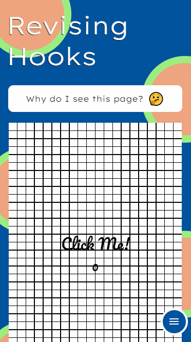
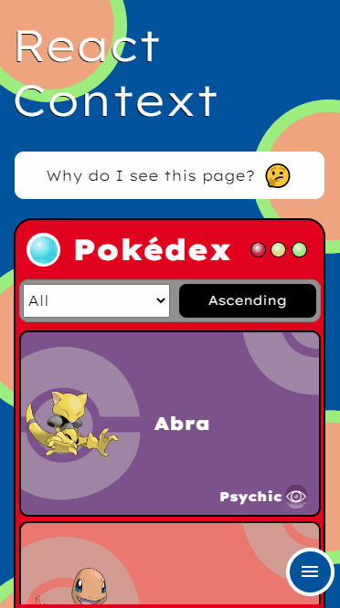
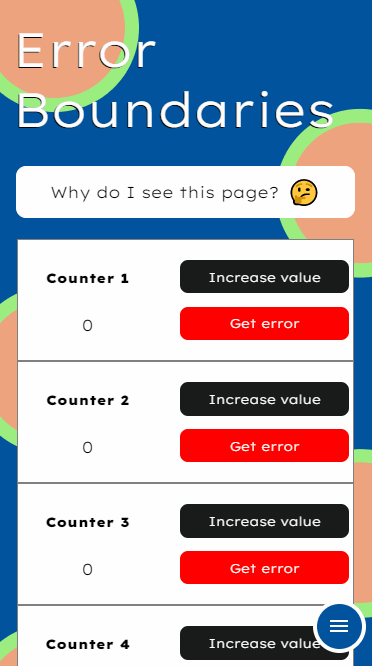
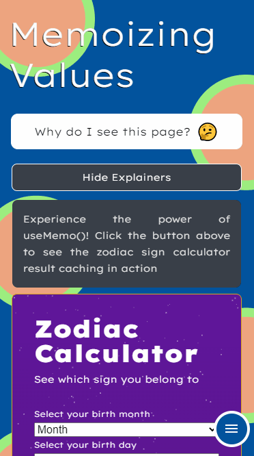
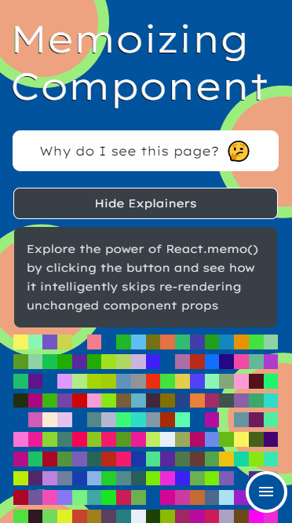
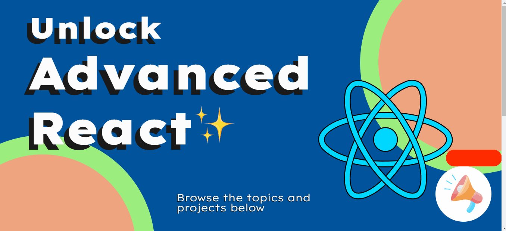
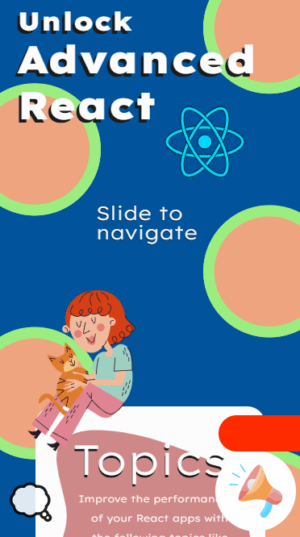

 
  <h1>Unlock Advanced React</h1>

 

  
  
  
  
  
  

## ✅ Índice
- <a href="#sobre">Sobre o Projeto</a>
- <a href="#motivo">Porque escolhi React?</a>
- <a href="#desbloquear">Como desbloquear essas novas habilidades?</a>
- <a href="#como_acessar">Como Acessar o Projeto</a>
- <a href="#status_projeto">Status do Projeto</a>
- <a href="#funcionalidades">Funcionalidades</a>
- <a href="#pre-requisitos-como-rodar">Pré-requisitos e como rodar o projeto</a>
- <a href="#tecnologias-ferramentas">Tecnologias e Ferramentas Utilizadas</a>
- <a href="#autor">Autor</a>
- <a href="#licença">Licença</a>

<h2 id="sobre">📝 Sobre o Projeto</h2>
Unlock Advanced React é um site que desenvolvi para ajudar os usuários a desbloquearem verdadeiramente novas habilidades com a renomada e poderosa biblioteca React.

<h2 id="motivo">🤔 Porque escolhi React?</h2>
Para tomar essa decisão, levei em consideração pontos como, um foco maior na experiência do usuário, tornando a aplicação mais intuitiva e visualmente atraente,  a escalabilidade da aplicação , facilidade na construção de interfaces, reutilização de componentes e também a popularidade de uso e de mercado dessa ferramenta.

<h2 id="desbloquear">🔓 Como desbloquear essas novas habilidades?</h2>
Ao acessar o site [Unlock Advanced React](https://learnadvancedreact.com.br/), você terá a oportunidade de explorar diversos tópicos e projetos que trazem benefícios significativos para suas aplicações. Nos tópicos, abordo assuntos como a criação de hooks personalizados para uma maior flexibilidade, estratégias para manter a organização da aplicação ao lidar com componentes compartilhados, técnicas de tratamento de erros para garantir uma excelente experiência do usuário, alternativas para otimizar o carregamento de telas mesmo com componentes ou funções complexas e, por fim, técnicas avançadas de divisão de código para melhorar a velocidade e o desempenho da aplicação em produção. Além disso, na seção de projetos, você encontrará o [Chatlla](https://chatlla.learnadvancedreact.com.br/), um site específico com seu próprio [repositório](https://github.com/GuilhermeAgostin/Chatlla), criado para fornecer uma experiência mais organizada e direcionada. Curioso(a) para saber quais tecnologias foram utilizadas no desenvolvimento desses sites? Continue aqui e confira.

## <h2 id="como_acessar">📁 Acesso ao Projeto</h2>
O projeto pode ser acessado através do link https://learnadvancedreact.com.br/ .

## <h2 id="status_projeto">👨‍💻 Status do Projeto</h2>
Em desenvolvimento 

## <h2 id="funcionalidades">🎨 Funcionalidades</h2>

#### Revisão de Aplicação e Efeito do useEffect()
> Na página de revisão da aplicação, você encontrará informações sobre como utilizar a função `useEffect()` do React para executar ações específicas em momentos específicos do ciclo de vida de um componente. O `useEffect()` é uma das funcionalidades mais importantes do React, pois permite que você controle as atualizações de estado e realize outras tarefas importantes.

#### Criação de Hooks customizáveis
> Aprenda a criar hooks customizados no React para reutilizar lógicas complexas em seus projetos.

#### Uso do Context do React
> Aproveite a funcionalidade do Context API do React para aprender como criar e gerenciar contextos globais em seus projetos. Com essa funcionalidade, você pode compartilhar dados entre componentes de forma eficiente e evitar a propagação excessiva de props.

#### Aplicação de Error Boundaries
> Saiba quando e como criar componentes que capturam erros em suas subárvores e exibem mensagens de erro adequadas ao usuário. As Error Boundaries são uma funcionalidade importante do React, pois permitem gerenciamento eficiente de erros e melhoram a experiência do usuário.

#### Memoização de Valores
> Veja como você pode memoizar valores computados para evitar cálculos desnecessários em seus componentes. A função `useMemo()` é uma funcionalidade avançada do React que permite que você optimize o desempenho de seus componentes, evitando cálculos desnecessários.

#### Memoização de Componentes
> A página sobre a função `React.memo()` mostra como você pode memoizar componentes para evitar que sejam renderizados desnecessariamente. A função `React.memo()` é uma funcionalidade do React que permite que você otimize o desempenho de seus componentes, especialmente quando são renderizados com frequência.

#### Memoização de Funções
> Saiba como memoizar funções para evitar recriações desnecessárias em seus componentes. A função `useCallback()` é uma funcionalidade avançada do React que permite que você optimize o desempenho de seus componentes,  evitando recriações de funções redundantes.

#### Code Splitting
> Aprenda a dividir o código do seu aplicativo em partes menores e carregá-las sob demanda. As técnicas de code splitting são uma funcionalidade importante do React que permitem que você melhore o desempenho do aplicativo ao carregar apenas o código necessário para cada página ou recurso.

#### Chat em tempo real
> Conheça um site em funcionamento que oferece uma plataforma de mensagens instantâneas fluida e acessível, podendo ser utilizada em qualquer dispositivo com acesso à internet, independentemente do sistema operacional. Para mais informações sobre o projeto, clique [aqui](https://github.com/GuilhermeAgostin/Chatlla).

 

## <h2 id="pre-requisitos-como-rodar">✔ Pré-requisitos e como rodar o projeto</h2>
De início, você vai precisar ter instalado em sua máquina as seguintes ferramentas:
- [Git](https://git-scm.com)
- [Node.js](https://nodejs.org/en/)

Além disso é bom ter um editor para trabalhar com o código como [VSCode](https://code.visualstudio.com/).

Agora para rodar o projeto é necessário seguir os seguintes passos:

    # Clonar o repositório
    $ git clone <https://github.com/GuilhermeAgostin/Unlock-Advanced-React.git>

    # Acessar a pasta do projeto no terminal/cmd
    $ cd unlock-advanced-react

    # Instalar as dependências
    $ npm install
      
    # Iniciar o projeto em modo de desenvolvimento
    $ npm run dev

    # O servidor inciará na porta:5173 - acesse <http://localhost:5173/>

## <h2 id="tecnologias-ferramentas">🔧 Tecnologias e Ferramentas Utilizadas</h2>
<!--ts-->
* [React.JS](https://react.dev/) : biblioteca JavaScript para construção de interfaces de usuário reativas e eficientes - usada para o desenvolvimento do front-end.
* [HTML](https://developer.mozilla.org/pt-BR/docs/Web/HTML) : linguagem de marcação que define a estrutura do site - usada para estruturação do site.
* [CSS](https://developer.mozilla.org/pt-BR/docs/Web/CSS) : linguagem de estilo utilizada para aprimorar a apresentação do site -  usada para estilização do site.
*	[Axios](https://axios-http.com/) :  biblioteca JavaScript baseada em Promises, utilizada para realizar requisições HTTP no navegador e no Node.js - usada para solicitações à API.
*	[Poké API](https://pokeapi.co/) : API pública que fornece informações sobre os pokémons, como seus tipos, habilidades, estatísticas, evoluções, entre outros - utilizada para obter os dados dos pokémons exibidos no site.
* [Vite](https://vitejs.dev/) : ferramenta de construção para otimização e empacotamento de código JavaScript, CSS e HTML - usado como ferramenta de build.
<!--te-->

## <h2 id="autor">✔ Autor</h2>

Feito com 🔎, 💪 e 🙏 por Guilherme de Agostin 👋 Entre em contato!

## <h2 id="licença">📜 Licença</h2>
Este projeto está licenciado sob a Licença Apache, Versão 2.0 - consulte o arquivo [LICENSE](./LICENSE) para obter detalhes.

  Este projeto é de código aberto. Seu código fonte pode ser usado, modificado e distribuído , desde que sigam certas condições como dar crédito ao autor original e incluir uma cópia da licença em qualquer distribuição do software.

